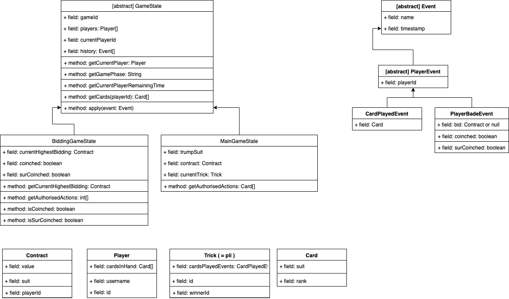

# Game engine initial design

## Information needed by the client

The client will need to have the following information at all times during a game. 

For all game stages:
- Current game stage (i.e. bidding or main game)
- Current player
- Remaining time to play/bid for the current player

For the bidding stage:
- Current highest bidding (i.e. the last one)
    - Suit
    - Value
    - Whether there is "coinche" (i.e. counter) or "sur-coinche" (i.e. double-counter).
- List of possible bidding for the current player
      
For the main game stage:
- Cards already played for the current trick
- Cards in the hand of the player
- Number of cards in the hand of the other players
- Cards the player is authorised to play
- Trump suit (for display purposes only)

## Actions we need to be able to perform from the client

For the bidding stage:
- make a bidding (including coinche and sur-coinche)
- pass

For the main game stage:
- play an authorised card

## Design for the game engine

We need an engine able to cope with the constraints/rules detailed above.
The game engine has the following properties:
- An encapsulated game state to store all the game information
- Getters to retrieve useful information about the game (listed in the previous section).
- A way to make the state evolve as the game is played.

**State representation:**
The current game state is stored so that the information listed above is easily accessible (see following diagram).

**Modification of the state:**
Each state modification corresponds to an event:
- An event is a simple object with a name, a timestamp, a playerId (when relevant) and some additional attributes. It represents something that occurred. 
- Using events allows to unify the state modification interface for both game stages (they will be modified in reaction to an event)
- There are very few types of event (i.e. actions) to implement: we do not add complexity.
- Events allow to replay each game later on if we want to.
- Events allow easy storage of an entire game
- We will have a unique event based system for both modifying the state of a game and for the client-server real-time interaction.

For now, we only need 2 types of events for the game engine:
- PlayerBadeEvent: when a player makes a bidding.
- CardPlayedEvent: when a player plays a card.

The following diagram details the structure of the game engine reflecting this decisions:
